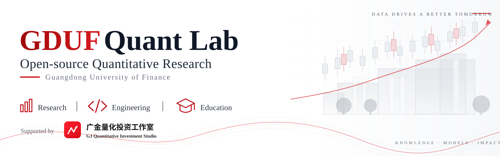

  

  <strong>Open-source quantitative research & education at Guangdong University of Finance</strong> 
  Research · Engineering · Education

---

## About

**GDUF Quant Lab** is an open-source quantitative research and education initiative supported by the **GJ Quantitative Investment Studio (广金量化投资工作室)** at **Guangdong University of Finance**.

We build reproducible research workflows and reusable open-source infrastructure for **factor research, financial data, quantitative analysis, and AI-assisted research**.

<table>
<tr>
<td width="33%" valign="top">

### Research

Factor construction, signal evaluation, cross-sectional analysis, and systematic quantitative research.

</td>
<td width="33%" valign="top">

### Engineering

Reusable data infrastructure, reproducible workflows, and research-grade quantitative tooling.

</td>
<td width="33%" valign="top">

### Education

Learning through research, project building, replication, and open-source collaboration.

</td>
</tr>
</table>

## Projects

| Project | Focus |
| :--- | :--- |
| **[alpha-lab](https://github.com/GDUF-QUANTLAB/alpha-lab)** | Factor research and quantitative analysis framework |
| **[alpha-skills](https://github.com/GDUF-QUANTLAB/alpha-skills)** | Structured domain skills for AI-assisted quantitative research |
| **[blazestore](https://github.com/GDUF-QUANTLAB/blazestore)** | Local Parquet storage for Polars research workflows |
| **[clickhouse_df](https://github.com/GDUF-QUANTLAB/clickhouse_df)** | Lightweight ClickHouse helpers for DataFrame workflows |
| **[xcals](https://github.com/GDUF-QUANTLAB/xcals)** | Chinese A-share trading calendar infrastructure |
| **[ygo](https://github.com/GDUF-QUANTLAB/ygo)** | Parallel task scheduling with progress tracking |

## Contributors & Acknowledgements

GDUF Quant Lab is built through collaboration among **students, researchers, and open-source contributors**. Contributions are credited through the Git history, issues, and pull requests across our projects.

Supported by **GJ Quantitative Investment Studio · Guangdong University of Finance**.

Special thanks to:

- **Prof. Wen-Hui Liao** — Founder, GJ Quantitative Investment Studio
- **Peng-Cheng Xu** — Academic & studio support
- **Dr. De-Huan Wan** — Academic & studio support

---

  <strong>Research with evidence. Engineer for reproducibility. Build in the open.</strong> 
  GDUF QUANT LAB · GUANGDONG UNIVERSITY OF FINANCE

  For education and research. Nothing published by this organization constitutes investment advice.

